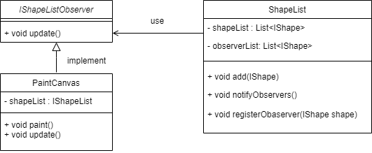
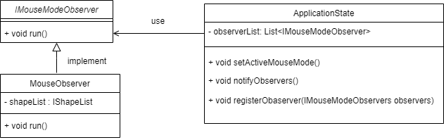
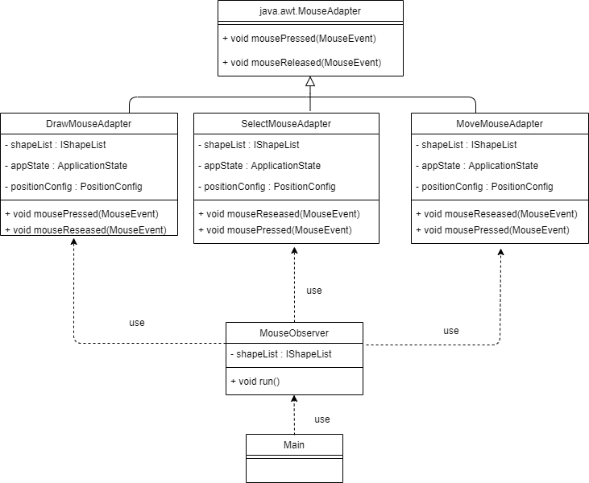
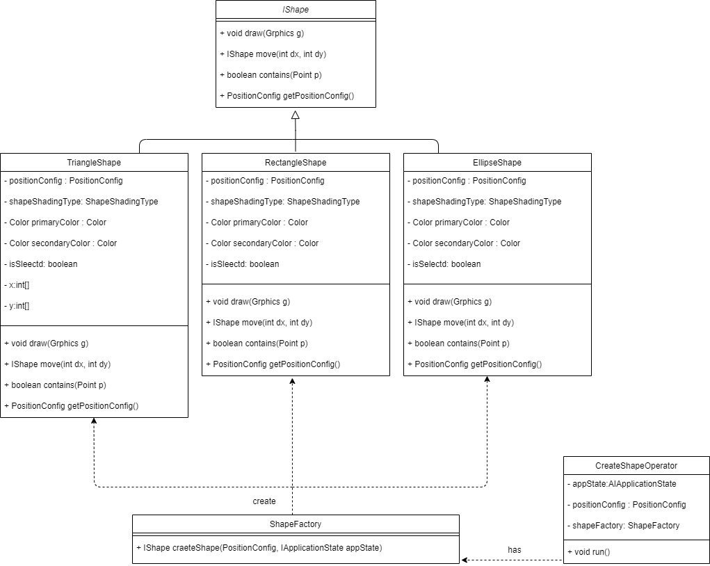
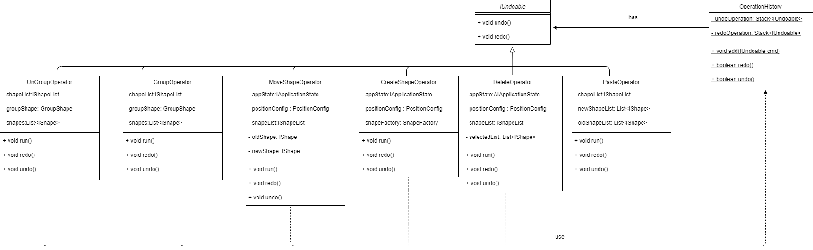
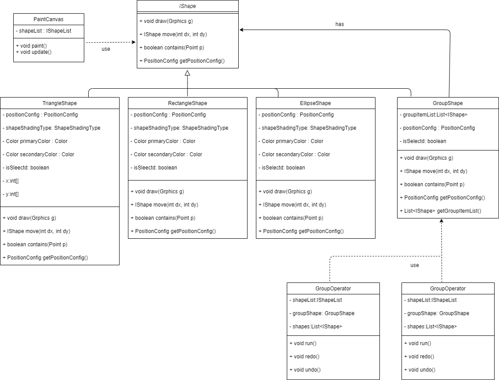

# J-Paint Project Report

contact email: ggy_778@sina.com

Note: Different Sprints are on features, naming like sprint1, sprint2, sprint3, and sprin4, which could be found in commit message and git branches.

[github link](https://github.com/santiweide/mini_painter)

## Content

[TOC]

## Project review

No missing features, but some bugs and extra features.

### Extra features - MS-Paint like Copy/Paste
* When Clicking Paste, anything in the origin select list will disappear, and the copied shapes will be in the select list. The UNDO and REDO are following the same logic. 

### BUG - Collision detect algorithm is not precise
* We only checks whether the mouse pressing place is contained inside the shapes' sensing boundaries.  If the mouse wants to draw a rectangle area and get all shapes covered, the area won't work, but the first click point works.

## Design Notes

We implements five kinds of design patterns in our projects.  Two Observer Pattern, one Adapter Pattern, one Factory Pattern, one Command Pattern and one Factory Pattern.  

## Observer Pattern
### `PaintCanvas` Observes  `ShapeList`
After the mouse event, we should paint. The Shapes we paint are stored in the` shapeList`, which is a singleton in the whole program.

Inside `ShapeList.add()` and `ShapeList.remove()`, `notifyObservers()` is called, so the `PaintCanvas` could repaint. 

​	

### `MouseObserver` Observes `ApplicationStates`

When Mouse Mode Changes，`MouseAdapter ` would distribute `DrawMouseAdapter`/`SelectMouseAdapter`/`MoveMouseAdapter`

How mouse observer dispatch different MOUSE_MODE is introduced in the next part: **Adapter Pattern**. 

## Adapter Pattern

### Mouse Event Adapters for different MOUSE_MODE

The inputs of the project including the inputs from clicking GUI buttons, and inputs of mouse events. The button clicks are handled in `controller.JPaintController` with `uiModule.addEvent`, and for mouse events, we design mouse listeners extending `java.awt.event.MouseAdapter`. Since there are three mouse modules, "DRAW", "SELECT" and "MOVE", we introduce three mouse adapters, `view.gui.mouse.DrawMouseAdapter`, `view.gui.mouse.SelectMouseAdapter`, and `view.gui.mouse.PaintMouseAdapter` to correspond to different mouse modes.

In `MouseObserver`, different implements of `MouseAdapter` are adopt. When we call run, which adapter runs depends on the application status' MOUSE_MODE. 

## Abstract Factory Pattern
### Shape Factory creating rectangles, triangles, and ellipses
There are four shapes defined in the project. When we draw, we could get Rectangle, Triangle and Ellipse. When we click group, we could get `GroupShape`. All the shape should support draw, select and move. So, they could all be implementing an interface `IShape`, with `draw()`, `contains()` and `move()` like methods. The shape factory uses the `ApplicationState` to get current shape, and gives out corresponding shape objects. 

As is illustrated  in the UML, `CreateShapeOperator` use `ShapeFactory` to create different shapes according to current application state's shape type. The reason why we use the `CreateShapeOperator` is introduced in the **Command Pattern** part. 

## Command Pattern
### `IOperator` for Undo and Redo
Since we should be able to redo and undo, some operations should be able to act like an object. So we design an interface `IUndoable`, which could be stored in stack inside `controler.OperationHistory`. `CreateShape`, `MoveShape`, and other operators are encapsulated and pushed into stack once they are operated. When the UNDO is called, the undo stack pops and redo stack pushes; when the REDO is called, redo stack pops and undo stack pushes. 
// this is a picture from draw.io

The Operators' run data are stored inside class, so while performing redo and undo, the new data and old data are both stored. The new or old data are update in the `ShapeList` , as operators are performed. 

## Composite Pattern

### The `GroupShape ` 
As Groups could act as a whole to be selected, moved, copied, pasted, and deleted, Groups could be treated like `IShape`. Moreover, Group could be added into Group, which means there could be a list of `IShape` describing what shapes are inside the group. That structure comes to composite pattern.  The group is hierarchical and could contain other group or shapes, like directory and files. Our design is as follows:

* When we press `GROUP`, the shapes in `selectedList` form a `GroupShape` and the `GroupShape` is added to `ShapeList` and `selectedList` with the origin `selectedList` candidates removed. 
* When we draw a `GroupShape`, each `IShape` in `GroupShape.groupItemList` call its `draw()` method, travelling all the shapes inside the group.  Each time we draw, the `GroupShape.position` updates to cover all the boundaries of the `IShape` inside.
* When we move a `GroupShape`, each `IShape` in `GroupShape.groupItemList` call its `move()` method, travelling all the shapes inside the group. 
* When we  ungroup, the `ShapeList` will find the last grouped `IShape`, and destruct it into `List<IShape>`. 

## Future Work (TODO LIST)

* `ShapeList` could be a Singleton
* Fix bugs
